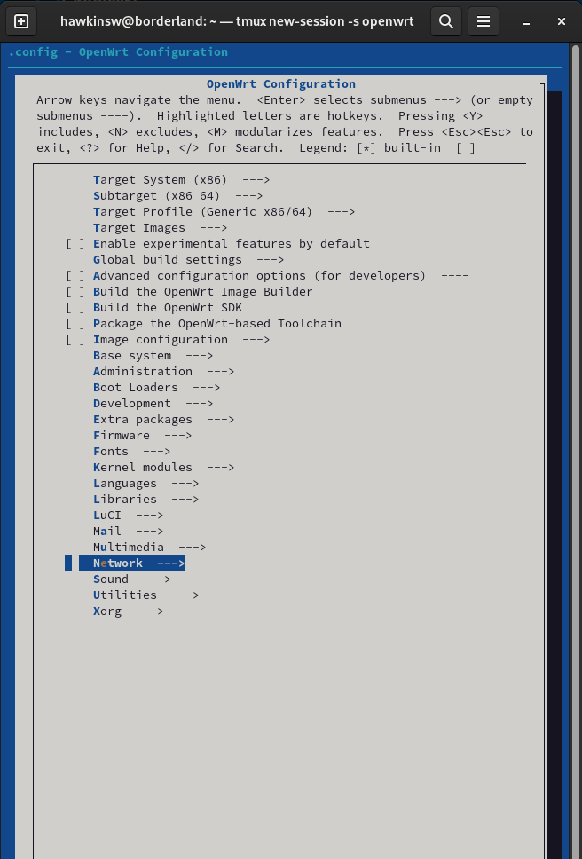
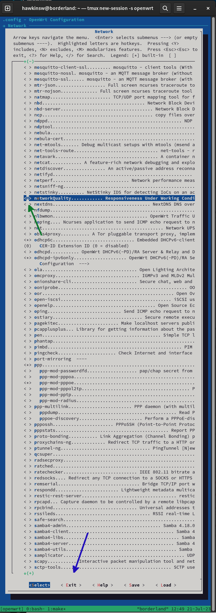

# Building for OpenWRT

## Prerequisites

It is, unfortunately, necessary that you are aware of most (if not all) of the subtleties of the OpenWRT build system to complete this process. For additional information on that process, check out their extensive build system documentation online [here](https://openwrt.org/docs/guide-developer/toolchain/use-buildsystem) and [here](https://openwrt.org/docs/guide-developer/toolchain/buildsystem_essentials).

In this documentation, it is assumed that your OpenWRT source tree exists in `${OPENWRT_SRC}`.

Finally, before building you will want to make sure that you have configured building the version of this client that you want. The version is selected by commit hash and you can customize that by changing the `PKG_SOURCE_VERSION` variable in the `Makefile`.

### Caveats

One of the things that seems to cause problems is that the steps for preparing the build system are scattered throughout the documentation. One of the easy-to-miss steps is

```console
$ make target
$ make target/install
```

It seems like [this](https://openwrt.org/docs/guide-developer/helloworld/chapter1) documentation would be good to merge with the documentation on the build system, but ...

If/when you attempt to build a different version of the client (i.e., when you change the `PKG_SOURCE_VERSION` in `Makefile` ), you can force the new version to be fetched by 

```console
$ rm -f ${OPENWRT_SRC}/networkQuality*
```

The OpenWRT build system caches the source and does not seem to handle well changing the `PKG_SOURCE_VERSION`. There is probably an easier way to do this cache reset, but ...

## Create Files

The driver (in the non-technical sense) of this entire process is a goresponsiveness-specific Makefile that will build the package. In order for the OpenWRT Build System to register that there is a new package, we have to put a `Makefile` in the proper spot. 

1. Make a directory name `networkQuality` in `${OPENWRT_SRC}/feeds/packages/net/`.

Then

2. Move (or, better yet, symbolically link) the `Makefile` in this directory to that newly created directory.

## Update the Feeds

Next, we have to update the build system's configuration so that it recognizes that the `networkQuality` package is now something that can be built. To do this, run

```console
$ make menuconfig
```

## Select networkQuality To Be Built

In `menuconfig`, navigate to `networkQuality` and select it to be built _as a module_. Building as a module means that you will get an `ipkg` that is easier to move between OpenWRT installations.

The `networkQuality` package is under `Network`:



To configure it to build as a module, you will want the space between the `<` and the `>` to be an `M` (indicated by the green arrow in the image below). To toggle through build types, use the space bar. Once you have configured it to build as a module, exit the configuration (indicated by the blue arrow in the image below).



## Build the Package

```console
$ make package/networkQuality/{clean,compile}
```

## Find the Result

That was pretty successful, wasn't it? Now we just have to find out where the build system stuck the resulting package! And that is easier said than done!

Depending on the target system for which you are building OpenWRT, the package that you just built will be in 

```
${OPENWRT_SRC}/bin/packages/<target>/packages/
```